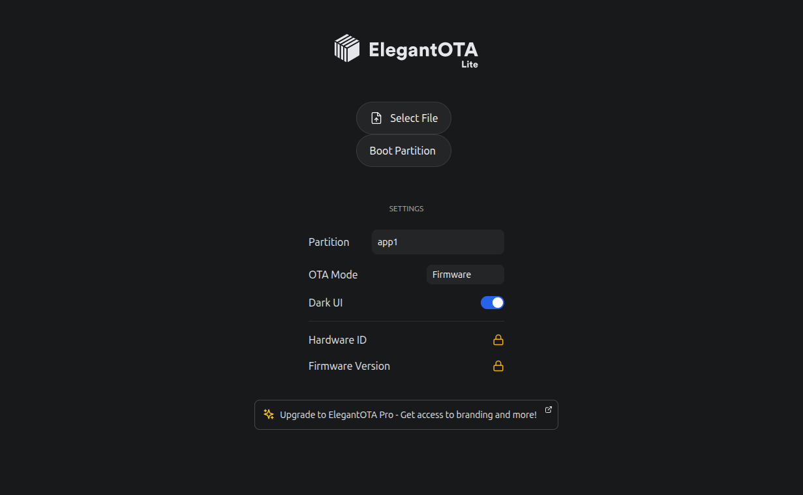

# ElegantOTA multipart

This is the default version of ElegantOTA extend with multi partition support. Multiple apps can be flashed and booted. The last flashed or booted partition is remembered in preferences. And will be booted automatically when the boot timer exceeds. The boot timer times out after 60000 ms and the last booted/flashed firmware will be started. 

Prepare your apps to always return to the first partition. Otherwise ElegantOTA will not be started anymore. See firmware_patches for meshtastic/meshcore.

